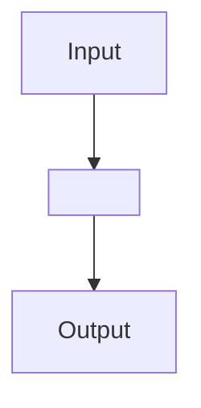

# Module: <repo-relative-path>

Source file: [`<repo-relative-path>`](../../<repo-relative-path>)
Human HTML view: [`../site/modules/<module-doc-html>`](../site/modules/<module-doc-html>)

## Purpose

<Explain what this file does and why it exists from product/system point of view.>

## Flow Diagram

## Functions and Responsibilities

| Function or Class | Responsibility | Notes |
| --- | --- | --- |
| `<name>` | `<what it does>` | `<important constraints>` |

## Dependencies

- Uses:
- Called by:

## Related Documentation

- System hub: [`../README.md`](../README.md)
- Section index: [`../api/README.md`](../api/README.md)
- Traceability: [`../utils/requirements_traceability_v0.md`](../utils/requirements_traceability_v0.md)
